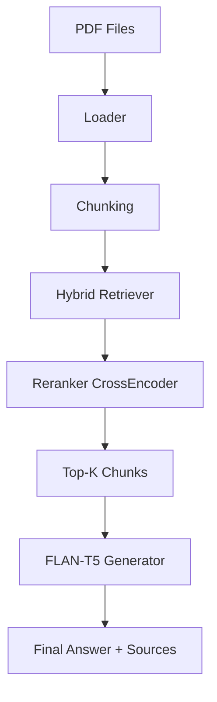

[](https://github.com/MeharVohra/production-rag-app/actions/workflows/rag-ci.yml)

# Production RAG Pipeline (PDF Question Answering System)

A Retrieval-Augmented Generation (RAG) system that answers questions from multiple PDF documents using hybrid retrieval, reranking, and a transformer-based LLM.

---

## 🚀 Features

- Multi-PDF document ingestion
- Page-level chunking
- Hybrid retrieval (dense + keyword-based)
- Cross-encoder reranking
- FLAN-T5 based answer generation
- Source attribution (page-level)
- Evaluation pipeline
- CI integration with GitHub Actions

---

## 🧠 Architecture

The system follows a modular RAG pipeline:

1. **Document Ingestion** — Loads multiple PDFs and extracts page-level text
2. **Chunking** — Splits documents into semantically meaningful chunks
3. **Retrieval** — Hybrid search combining dense (vector) and sparse (BM25) methods
4. **Reranking** — CrossEncoder scores query–chunk relevance with optional source weighting
5. **Generation** — FLAN-T5 generates a final answer using the top retrieved chunks

---

## 🏗️ Architecture Diagram



---

## 📊 Example Queries

**Q: What is diabetes mellitus?**
```
A: A metabolic disorder of multiple aetiology.
Sources: Page 7, Page 19
```

**Q: How is diabetes classified?**
```
A: Diabetes is classified into types based on aetiology and clinical stages.
Sources: Page 6, Page 25
```

**Q: What is insulin used for?**
```
A: It helps move sugar in the blood to other parts of the body.
Sources: Page 0, Page 1
```

---

## 🧪 Evaluation

The system includes an automated evaluation script that checks answer quality using:

- Token overlap scoring
- Synonym matching
- Recall-based accuracy metric

---

## ⚙️ CI Pipeline

GitHub Actions runs on every push to `main`:

- Unit tests
- Evaluation checks
- Full RAG pipeline test

---

## 📦 Installation

```bash
pip install -r requirements.txt
```

## ▶️ Run Pipeline

```bash
python -m tests.test_rag_pipeline
```

---

## 🧑‍💻 Tech Stack

| Layer | Tool |
|---|---|
| Language | Python |
| Deep Learning | PyTorch |
| LLM | HuggingFace Transformers (FLAN-T5) |
| Embeddings | SentenceTransformers |
| Document Loading | LangChain |
| Vector Store | ChromaDB |
| CI | GitHub Actions |

